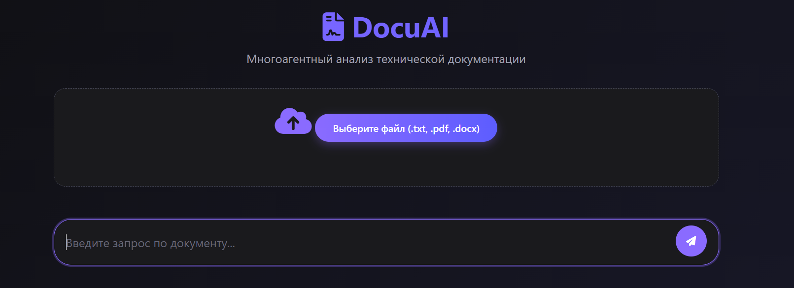

# DocuAI+

DocuAI+ — Умная платформа для автоматизации научно-технической информации и генерации целевой рекламы на её основе. Система позволяет загружать документы, задавать уточняющие вопросы и получать структурированные ответы на основе содержимого файлов.

[](https://python.org)
[](https://fastapi.tiangolo.com)
[](https://developers.sber.ru/docs)

## Основные возможности

- Загрузка и обработка текстовых документов (PDF, DOCX, TXT и др.)
- Анализ содержимого с учётом контекста запроса пользователя
- Поддержка многоагентной архитектуры: каждый агент получает как документ, так и оригинальный пользовательский промпт для точного анализа
- Интеграция с API крупных языковых моделей (GigaChat)

## Структура проекта
```
DOCUAI+/
│
├── agents/ # Модули агентов для обработки документов
│ ├── pycache/ # Кэш модулей агентов
│ ├── document_analyst.py # Агент для анализа содержимого документа
│ ├── marketing_expert.py # Агент-маркетолог: анализ маркетинговых аспектов
│ ├── summarizer.py # Агент для создания краткого содержания
│ └── technical_reviewer.py # Технический рецензент: отвечает на основе документа
│
├── static/ # Статические файлы 
│ └── index.html # Главная страница интерфейса 
│
├── uploads/ # Папка для загруженных пользователем документов
├── utils/ # Папка с утилитами (санитайзер)
│
├── .env # Файл переменных окружения (API ключи, настройки)
├── agent_orchestrator.py # Оркестратор агентов — координирует работу всех агентов
├── backend.py # Основной бэкенд приложения
├── requirements.txt # зависимости
├── README.md # Данный файл — описание проекта
├── test.txt # Лог тестов
├── test.py # тесты
├── test_marketing.py # тесты рекламы
├── marketing_test.txt # логи тестов рекламы
├── sanitizer_test.py # тесты санитайзера
├── sanitizer_test.txt # логи тестов санитайзера

```

## Установка зависимостей
```
pip install -r requirements.txt
```

## Запуск

```
uvicorn backend:app --reload
```

